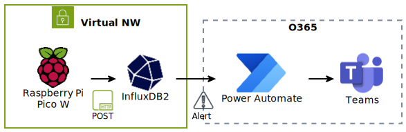
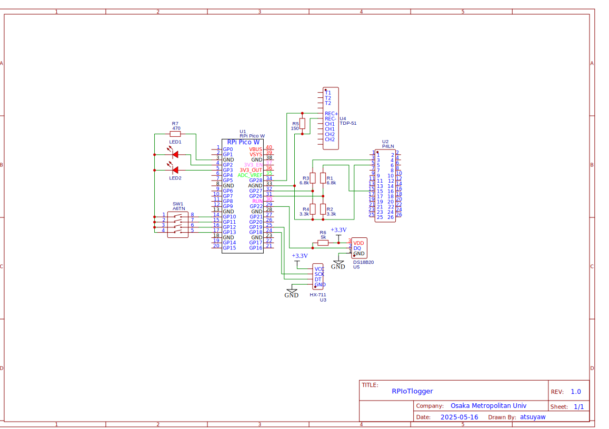

  

Raspberry Pi PicoW to get sensor output and post API for InfluxDB

<!-- https://www.plantuml.com/plantuml/svg/jLL_Jniv4Fr_FuLP8RL8R9nGe0Swga90N7G58XBAFqYLTpr9BBpsofub8DJlVcDdaq15cljnZQBTjUVDl3TZU_pPet1ObpfvntBXGJ9hs0InyeUS5mA5jkDMxJCG7hDEgt9MjgRMtVk9hNnBJ3rVZFZ7lPsHRE-ARFIn-93j7eXs9iAZECZtGEwss_kTd8F9RWQyi18gLO5M1Z9uH30o8GKtfh1b2GOPJe058yj1soaRMSTIATmzAyapPHwVo3fEtcri7jyElfqUN__9ZXYw6f9aGy8eU9AXJuajid5YsXehdDHvxS4LrX0hjeYGKnfQv3wyCqK6dn5VLcbXGcNuG-UtLfjBvJ7PKARGjLm4v_JkacHhMXKDtx1NbLPKHsLDZmZ7BdxoWIeh3PSMrQYn3i0zg09MX26EgaRWPzsT5OXpCE24vZSUt0h80AqJOsZ8cz4htkIDkCxMbP-5LqM4hGB5OcXRosEDFmVswvogCgXp0wkGeLgEp5UZuOHMslEU7Vun7FRxpg8jhFu7Rl5hdi3wwlaLc4l0iDSfLdUsTqv1gmTmJ_nhlpldFHS8K_6qXkPOWyCrc5E1OYXo3Mjm5u2Kbr-3wau4hXDLumGCXlq8CXHY3Vwi5AfPXd1sPqlBX0Fce41XnXeycogSCC6AsgCjux45Ldkg8Ns30ujF5R2C6G39qBA9af24nmjpugdcbN2YZ1qXUbY74xiqB1dPSyBeToAA-p49Ch9hjNKiTecJys_TgozNrpE4THBSp8fE64-1m63oFUJIT916TULi0R9s4DiGHMBDeM6XMJ1XIFhKHd6UsH53UAHEiV2Av3r2lj_qCxzjjXd0dUQzSvIcMyaoXJGwbEC5VklEp1oQzqwQR82H2uPasVG6_UlUy6nmS_tbR_IzUOVBF4gjSZvMEXUE_Y9RcYgd43mrmLQ7DuC5M-_Y-FniyAlOAZFsbDhBPX4tsNi2FGY4ozljzAjoM0lDBc_JhUUNDVnTbUF3fJxIvQiSd7lAAjMYoC--41gEsgs3xv_kpFNSolhgplHLOTbjoeHdpMO_XR0EFuklp4ZNZpAF5qWWeAYzE7TwiXD3pH6qnPfcDClcwiF-tdOQdc-biBwk7ihAUYm5jwCHgQH0KOJdfGYdADIHx-zo157wHjamV4TL5uCu_ozuIrKuw-q8UTzEmPtqibx3gWplNvxFfZDgAxOK25ayQo1V5R-p5weVWMmEZB94CmZdyTKQiEpJefA7BBqpKUr_lUEZw7Z5hxzuNkgVoRyQ3DDaBee4BjH7WUn_LlZZBVAZd3YT9dCDB7EaQBxCdy58YlON -->

### Credit
- https://github.com/raspberrypi/pico-micropython-examples/blob/master/adc/temperature.py
- https://teratail.com/questions/buag9os7aoj9en
- https://qiita.com/smart_agri_lab/items/0a63b7cf0ad71e2015ba
- https://github.com/endail/hx711-pico-mpy
- https://github.com/micropython/micropython-lib/blob/master/micropython/drivers/bus/onewire/onewire.py
